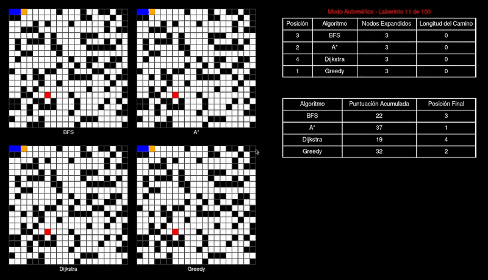

# Pathfinding Algorithms Comparison

## Descripción del Proyecto

Este proyecto tiene como objetivo comparar el comportamiento de diferentes algoritmos de búsqueda de caminos en laberintos generados aleatoriamente. La aplicación visual, desarrollada en Pygame, muestra en paralelo la ejecución de cada algoritmo sobre el mismo laberinto y registra diversas métricas (número de nodos expandidos, longitud del camino, etc.). Además, se otorgan puntos a cada algoritmo según su rendimiento en cada corrida, permitiendo obtener una puntuación acumulada que determina cuál se comporta mejor de forma general.

## Algoritmos Utilizados

- **BFS (Breadth-First Search):**  
  Un algoritmo de búsqueda por anchura que explora todos los nodos a una misma distancia antes de avanzar. Garantiza encontrar el camino más corto en laberintos con costos uniformes.

- **A* (A-star):**  
  Combina la búsqueda de costo uniforme con una heurística (distancia Manhattan en este caso) para dirigir la búsqueda hacia el objetivo, siendo generalmente más eficiente que BFS en laberintos grandes.

- **Dijkstra:**  
  Un algoritmo de búsqueda de caminos que garantiza encontrar la ruta óptima en grafos con pesos no negativos. Se comporta de manera similar a A*, pero sin el componente heurístico.

- **Greedy Best-First Search:**  
  Se centra únicamente en la heurística para decidir qué nodo explorar a continuación. Es muy rápido, aunque no siempre garantiza el camino óptimo, lo que lo hace interesante para comparar su desempeño frente a los otros algoritmos.

## Sistema de Puntuación

En cada laberinto se evalúa el rendimiento de cada algoritmo:
En cada laberinto se otorgan de **4 a 1 punto(s)** a los algoritmos que encuentran solución, según la siguiente lógica: 
- Se premia al algoritmo que obtiene la menor distancia.
- En caso de empate, se favorece al que ha utilizado menos nodos. 
- Si un algoritmo no encuentra solución, se le asigna **0 puntos**.

Estas puntuaciones se acumulan a lo largo de múltiples ejecuciones y se muestran en una tabla acumulativa, junto con la posición final (ranking) basado en la puntuación acumulada.

## Demo

